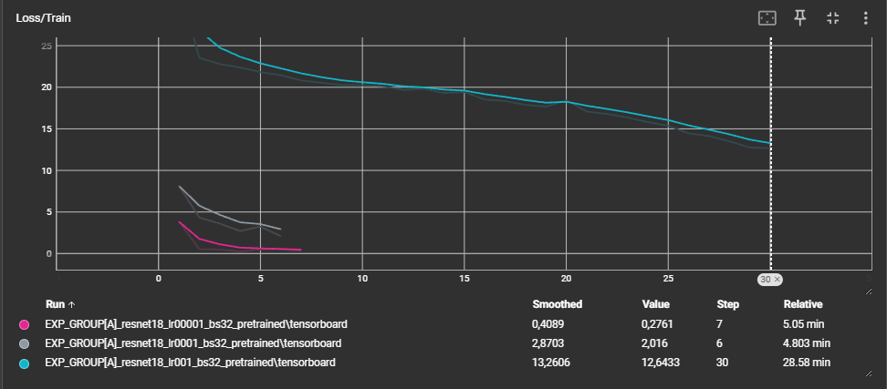
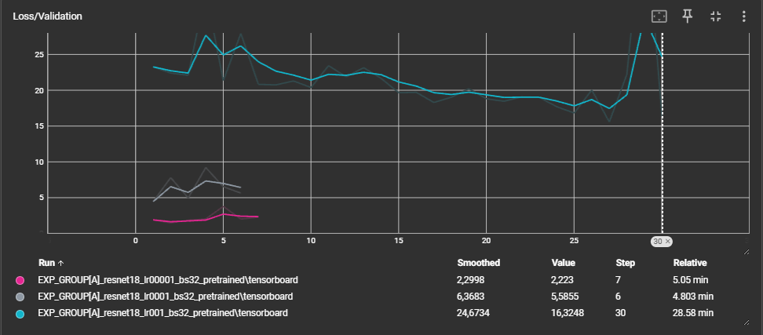
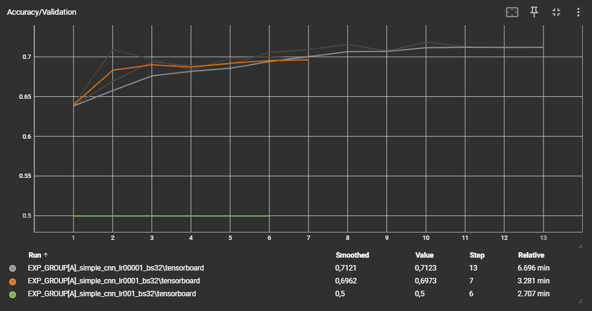
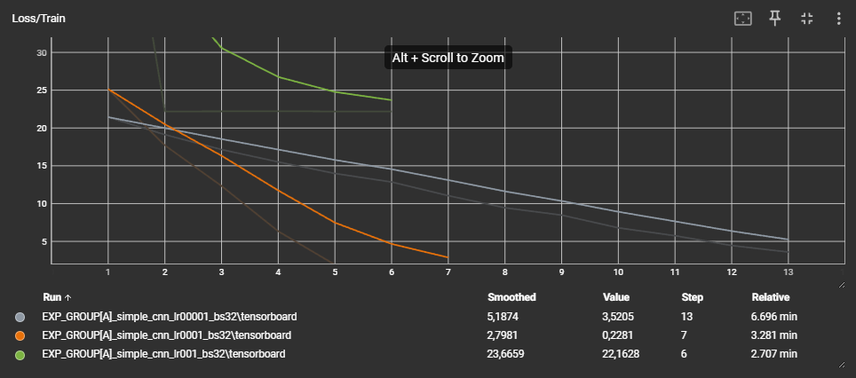
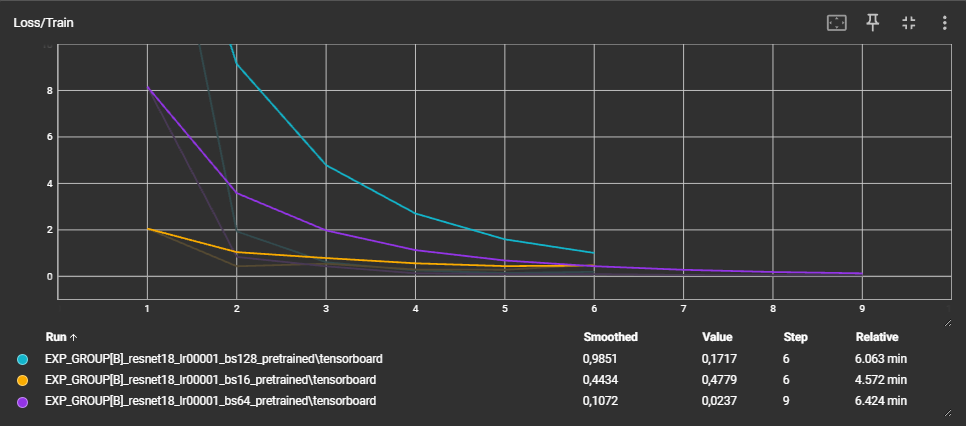
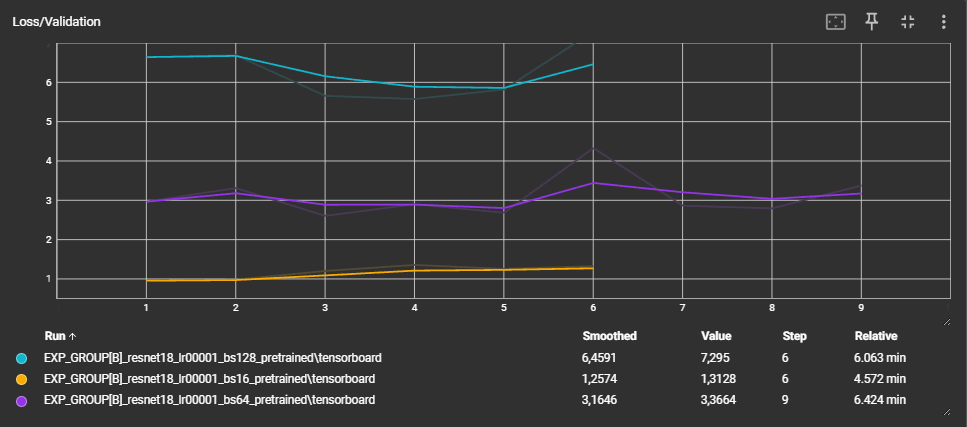
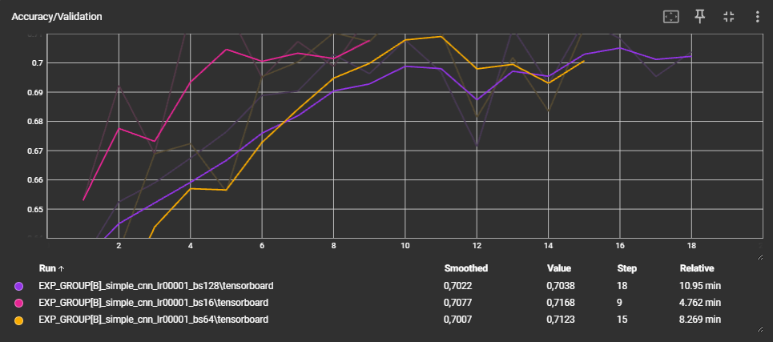
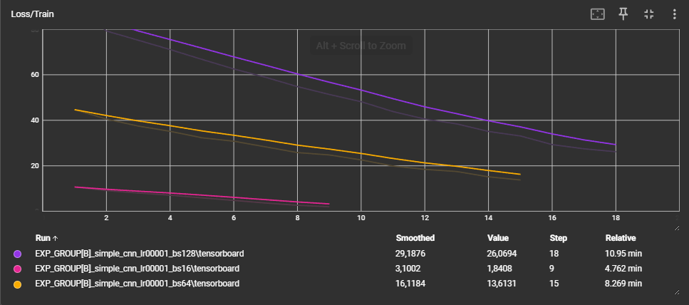
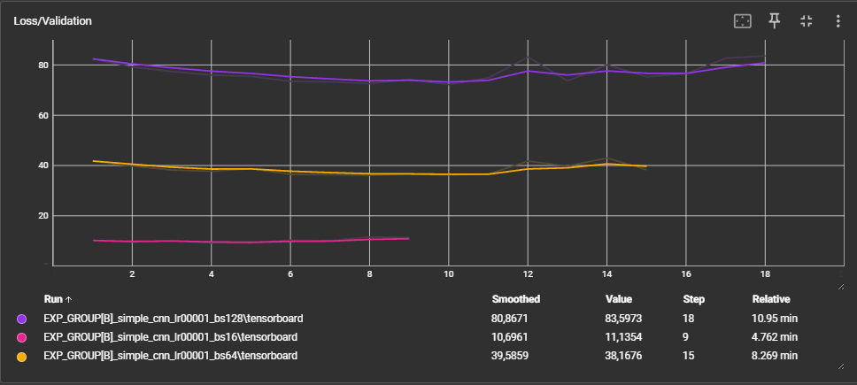

# 🐶🐱 Dogs vs Cats Classifier – Progetto AI
## Progetto per il corso di Laboratorio di ottimizzazione, intelligenza artificiale e machine learning, realizzato da Naman Bagga il 08/01/2026.
Un progetto completo per la classificazione di immagini di cani e gatti tramite reti neurali convoluzionali (CNN) e transfer learning con ResNet18.  
Include addestramento, validazione, logging avanzato, resume training, predizione e confronto dei modelli.

---

## 📌 Caratteristiche principali

### ✔️ Modelli implementati
- **SimpleCNN** – rete neurale progettata da zero  
- **ResNet18** – rete pre-addestrata tramite transfer learning

### ✔️ Funzionalità del sistema
- Dataset loader con trasformazioni e normalizzazione
- Early stopping avanzato (monitor accuracy/loss + target accuracy)
- Resume training automatico dai checkpoint
- Salvataggio automatico:
  - Checkpoint per epoca
  - `best_model.pth`
- TensorBoard logging:
  - Loss / Accuracy
  - Confusion Matrix
  - Architettura del modello
  - Immagini del dataset

### ✔️ Modalità operative
- `train` – Addestra il modello
- `eval` – Valuta il modello migliore
- `predict` – Predice classe di un'immagine singola
- `resume` – Riprende il training dall’ultimo checkpoint

---

## 📂 Struttura del progetto
```
PROGETTOAI_MIGLIORATO/
│
├── config/                 # configurazioni e schema
    ├──config.yaml
    ├──schema.py
├── experiments/            # cartella esperimenti
    ├── ..../
        ├──checkpoints/    # cartella checkpoint 
        ├──tensorboard/    # logdir per eseguire tensorboard
├── image/                  # immagini esperimenti per report
├── models/                 # SimpleCNN + ResNet18
    ├──simple_cnn.py
    ├──resnet18.py
├── utils/                  # dataloader, early stopping, seed
    ├──dataloader.py
    ├──early_stopping
    ├──seed.py              
├── scripts/                # script che vengono importati nel main
    ├── train.py            # training completo
    ├── evaluate.py         # valutazione sul validation/test
    ├── predict.py          # predizione su singola immagine
├── main.py                 # entry point con modalità
│
├── requirements.txt        # file librerie utilizzate
├── README.md
└── .gitignore
```

---

## ⚙️ Installazione

Assicurati di avere Python 3.9+ installato.

```bash
pip install -r requirements.txt
```

---

## ▶️ Utilizzo
### Avvio del training
```bash
python main.py --mode train
```
### Ripresa del training
```bash
python main.py --mode resume
```
### Valutazione del modello
```bash
python main.py --mode eval
```
### Predizione singola immagine
```bash
python main.py --mode predict
```
Dopo aver eseguito il comando ti verra chiesto:
```
Inserisci il percorso dell'immagine per la predizione:    (es. data/test/cats/cat.40XX.jpg)
```
### TensorBoard
```bash
tensorboard --logdir runs
```
Apri il link nel browser e troverai:
- Loss (train/validation)
- Accuracy
- Matrice di confusione
- Immagini campione
- Architettura del modello

---

## 🎯 Motivazioni delle Scelte Progettuali

Questo documento spiega **perché** sono state fatte determinate scelte tecniche nel progetto *Dogs vs Cats Classification*.  
Le motivazioni aiutano a comprendere la logica della struttura del codice, le tecniche utilizzate e le decisioni progettuali.

---

## 🧠 1. Scelta di implementare un modello SimpleCNN da zero

### Perché questa scelta
- Serve come **baseline** semplice per confronti futuri.
- È un ottimo strumento **didattico** per comprendere il funzionamento delle CNN.
- Permette di capire limiti e problematiche del training da zero.

### Vantaggi
- Semplice da modificare e testare.
- Ottimo per imparare e per debugging.
- Addestramento rapido.

### Limiti
- Prestazioni inferiori ai modelli pre-addestrati.
- Maggiore rischio di overfitting.
- Meno generalizzazione.

---

## 🧩 2. Scelta di usare ResNet18 con Transfer Learning

### Perché questa scelta
- Modello collaudato, efficiente e bilanciato.
- Il transfer learning sfrutta i pesi di ImageNet.
- Ideale per dataset medio-piccoli come Dogs vs Cats.

### Vantaggi
- Migliore accuratezza e stabilità.
- Richiede meno epoche di training.
- Rischio di overfitting ridotto.

### Limiti
- Più pesante del SimpleCNN.
- Meno flessibile da modificare internamente.

---

## ⏳ 3. Early Stopping avanzato

### Perché implementarlo
- Evita overfitting inutile.
- Riduce il tempo di addestramento.
- Salva automaticamente il miglior modello.

### Caratteristiche implementate
- Monitor su **accuracy** o **loss**.
- `min_delta` per evitare miglioramenti insignificanti.
- `patience` configurabile.
- Supporto per `target_accuracy`.

---

## 💾 4. Organizzazione dei checkpoint per modello

I checkpoint vengono salvati in cartelle separate:
```
checkpoints/simple_cnn/
checkpoints/resnet18/
```
### Perché questa scelta
- Evita confusione tra modelli diversi.
- Permette di riaddestrare o valutare ogni modello individualmente.
- Mantiene il progetto pulito e organizzato.

Ogni checkpoint contiene:
- pesi del modello
- stato dell’optimizer
- epoca corrente
- miglior modello (`best_model.pth`)

---

## 🔄 5. Resume Training automatico

### Perché implementarlo
- Utile se il training viene interrotto (crash, terminale chiuso).
- Permette training incrementale.
- Nessuna necessità di specificare manualmente i file.

### Funzionamento
- Individua automaticamente l’ultimo checkpoint disponibile.
- Ripristina modello, optimizer, epoca.
- Continua senza perdere informazioni.

---

## ⚙️ 6. Configurazione esterna tramite `config.yaml`

### Perché un file YAML
- Raccoglie in un solo punto tutti i parametri:
  - batch size  
  - learning rate  
  - modello da usare  
  - early stopping  
  - dimensione immagini  
  - cartella dei dati  
- Evita parametri hard-coded nel codice.
- Maggiore riproducibilità degli esperimenti.

### Validazione Pydantic (`schema.py`)
- Controlla automaticamente tipi e valori.
- Intercetta subito configurazioni errate.
- Documenta chiaramente quali campi sono obbligatori.

---

## 📊 7. Uso avanzato di TensorBoard

TensorBoard è stato integrato per monitorare:

- Loss di training
- Loss di validazione
- Accuracy
- Architettura del modello
- Immagini di esempio
- **Confusion matrix**
- Confronto tra modelli tramite cartelle separate in `runs/`

### Perché questa scelta
- Permette di visualizzare immediatamente overfitting.
- Facilita il debug.
- Permette confronti diretti tra modelli.

---

## 📉 8. Confusion Matrix visualizzata in TensorBoard

### Perché implementarla
- L’accuracy non basta per valutare le prestazioni.
- La matrice di confusione mostra:
  - dove il modello sbaglia
  - se confonde più spesso cani o gatti
  - eventuali bias nelle predizioni

### Vantaggi
- Facilita la comprensione degli errori.
- Mostra differenze chiare tra SimpleCNN e ResNet18.

---

## 📈 Analisi dei risultati degli esperimenti (SimpleCNN vs ResNet18)

Questa sezione riassume l'analisi dei grafici ottenuti con TensorBoard, confrontando gli esperimenti su:
- learning rate
- batch size
- epoche

### Learing Rate: ResNet18 (pretrained, con pesi di ImageNet)
### ✅ Accuracy in Validazione
- LR = 0.0001 [magenta]: molto alta e stabile, il migliore dei tre

- LR = 0.001 [grigio]: discreta ma comunque con valori accettabili

- LR = 0.01 [azzurro]: bassa (0.50 -> 0.75 dopo molte epoche), probabilmente il modello impara con molta difficolta a causa del LR troppo alto


### 🔥 Loss in training
- LR = 0.0001 [magenta]: molto bassa e stabile, buona convergenza (diminuisce in modo coerente e si stabilizza su un valore basso non presentando grandi oscillazioni)

- LR = 0.001 [grigio]: situazione intermedia, la convergenza è abbastanza pulita nonostante ci siano delle oscillazioni (parte alta ma piano piano diminuisce, il modello impara ma non in modo stabile)

- LR = 0.01 [azzurro]: inizialmente molto alta, scende molto lentamente ed è fortemente instabile



### ⚠️ Loss in validazione
- LR = 0.0001 [magenta]: valori bassi, nessuna grossa oscillazione e andamento regolare

- LR = 0.001 [grigio]: valore più alto, oscilla molto e non mostra un miglioramento netto

- LR = 0.01 [azzurro]: valori altissimi, peggiora nelle ultime epoche e perde il controllo



in sintesi:
- 0.0001 -> il modello impara bene e generalizza bene
- 0.001 -> il modello impara ma non in modo ottimale
- 0.01 -> il modello non impara

### Learning Rate: SimpleCNN (modello da zero)
### ✅ Accuracy in Validazione

- LR = 0.0001 [grigio]: sale gradualmente, è stabile ed è il miglior LR perchè impara lentamente ma in modo pulito

- LR = 0.001 [arancione]: sale in modo instabile e poi non migliora più

- LR = 0.01 [verde]: rimane piatta, a quanto pare il modello indovina in modo random e di conseguenza non sta imparando nulla



### 🔥 Loss in training

- LR = 0.0001 [grigio]: scende molto lentamente ma in modo pulito

- LR = 0.001 [arancione]: scende molto rapidamente ma non sta seguendo il trend (la linea arancione più scura)

- LR = 0.01 [verde]: inizialmente altissima, scende pochissimo ma rimane comunque enorme



### ⚠️ Loss in validazione
- LR = 0.0001 [grigio]: scende inizialmente ma poi risale in modo lento, è la curva meno instabile e strana

- LR = 0.001 [arancione]: sale in modo molto velocemente, probabilmente non sarebbe in grado di dare previsioni su nuovi dati accurati perchè fallisce sul set di validazione

- LR = 0.01 [verde]: nessuna capacità di apprendimento, è piatta


in sintesi:
- 0.0001 -> il modello impara in modo sano ma lento
- 0.001 -> il modello imparara ma nella pratica darebbe problemi
- 0.01 -> il modello non impara

### Batch size: ResNet18 (con il miglior learning rate e con i pesi di ImageNet)

### ✅ Accuracy in Validazione
- BS = 16 [giallo]: andamento irregolare e calo nelle prime epoche (performance peggiori)
- BS = 64 [viola]: abbastanza stabile, non ha troppe oscillazioni, probabilmente il migliore
- BS = 128 [azzurro]: partenza ottima ma leggermente sotto al viola e presenta più oscillazioni


### 🔥 Loss in training
- BS = 16 [giallo]: converge più rapidamente a causa di overfitting
- BS = 64 [viola]: converge abbastanza rapidamente ma ha un comportameno stabile con un andamento pulito e regolare
- BS = 128 [azzurro]: converge più letamente, il modello non impara abbastanza dal training e quindi non migliora in validazione



### ⚠️ Loss in validazione
- BS = 16 [giallo]: bassa e stabile, nessuna oscillazione importante
- BS = 64 [viola]: andamento accettabile senza troppe oscillazioni
- BS = 128 [azzurro]: andamento oscillante, inizia abbastanza stabile per poi scendere e risalire



### Batch size: SimpleCNN (con il miglior learning rate)

### ✅ Accuracy in Validazione
- BS = 16 [magenta]: sale rapidamente già dalle prime epoche, ha oscillazioni ma non drammatiche
- BS = 64 [giallo]: va bene ma ha più oscillazioni
- BS = 128 [viola]: stabile ma più basso



### 🔥 Loss in training
- BS = 16 [magenta]: molto bassa, scende rapidamente
- BS = 64 [giallo]: parte alta, più lenta 
- BS = 128 [viola]: parte altissima, scende lentamente e resa comunque elevata dopo un tot di epoche




### ⚠️ Loss in validazione
- BS = 16 [magenta]: stabile, nessun segnale di overfitting
- BS = 64 [giallo]: più alta, oscilla un po'
- BS = 128 [viola]: altissima, scende ma rimane comunque altissima


In sintesi:
- BS = 16 -> è la migliore, equilibrata, migliore accuratezza e generalizzazione ottima
- BS = 64 -> apprende ma lentamente, ha una loss di validazione alta
- BS = 128 -> la loss rimane troppo alta e il learning rate è troppo basso per un batch di queste dimensioni
---

## ✔️ Conclusione

Le scelte progettuali hanno permesso di ottenere:

- un codice **pulito e modulare**
- un sistema **estendibile**
- un training **controllato e sicuro**
- metriche dettagliate per l’analisi
- confronto diretto tra modelli
- riproducibilità totale degli esperimenti
